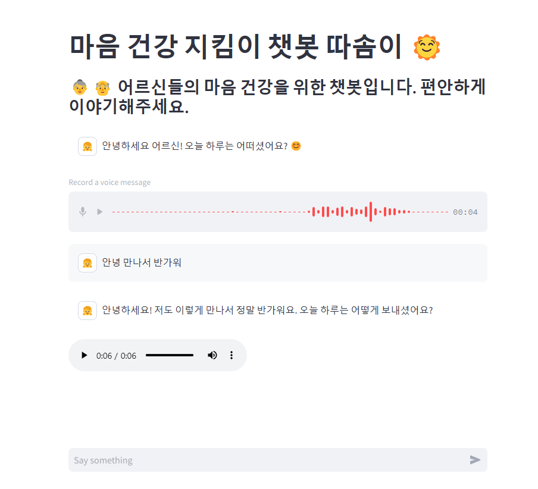

# 🤖 챗봇 프로젝트

## 📌 프로젝트 소개
이 프로젝트는 OpenAI의 GPT 모델을 활용한 음성 챗봇입니다.  

- 독거노인을 위한 치매 예방 및 감정 케어 목적의 음성 기반 AI 대화 로봇 개발

- 노인분들을 위한 손녀,손자와 같은 대화형 프롬프팅 진행

- 음성 기반 대화 인터페이스 구축 및 감정 인식 알고리즘 적용


## 🛠️ 기술 스택
- Python 3.x
- streamlit
- OpenAI API
- STT ( Whisper )
- TTS (Elevenlabs API) 
- dotenv (환경 변수 관리)
- Langchin

## 🚀 설치 방법
1. Python이 설치되어 있는지 확인하세요.
2. **가상 환경 생성 및 활성화**
```bash
    # Mac/Linux
    python -m venv venv
    source venv/bin/activate

    # Windows
    python -m venv venv
    venv\Scripts\activate    
```
3. 필요한 패키지 설치
```bash
    pip install -r requirements.txt
```
## 🚀실행 방법

1. 환경 변수 설정<br>
.env 파일을 만들고 OpenAI API 키를 추가하세요.

    ```ini
    OPENAI_API_KEY = your_api_key_here
    elevenlabs_api_key = your_api_key_here
    ```
2. 챗봇 실행 <br>
streamlit 서버를 실행하여 챗봇을 동작 시킵니다.
    ```bash
    streamlit run app.py
    ```
    
## 🎯 핵심 기능
✅ OpenAI의 GPT API를 활용한 자연어 처리

✅ 사용자 음성을 입력 받아 AI 챗봇이 음성으로 응답을 제공 (STT &TTS)

✅ streamlit을 사용한 간단한 API 서버 구현

✅ .env 파일을 활용한 API 키 보안 관리

✅유저용 웹 어플리케이션 연동

✅DB에서 대화 로그 관리 및 감정 분석 데이터 확인

## 📄 라이선스
이 프로젝트는 MIT 라이선스를 따릅니다. 자유롭게 수정 및 배포가 가능합니다.

## 📄 도메인
http://ddasom.store/