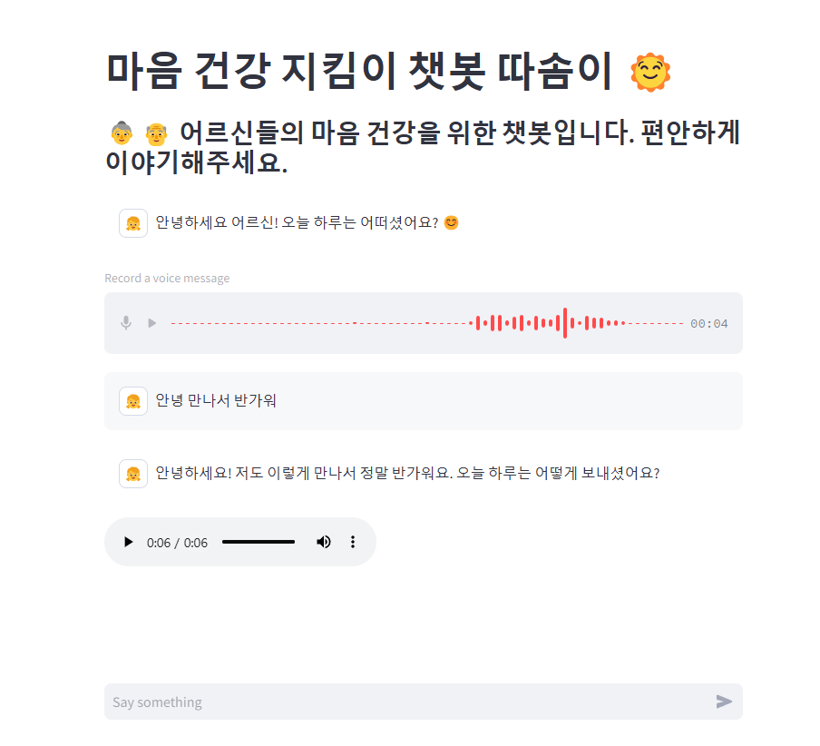

# 🤖 챗봇 프로젝트

## 📌 프로젝트 소개
이 프로젝트는 OpenAI의 GPT 모델을 활용한 음성 챗봇입니다.  

- 독거노인을 위한 치매 예방 및 감정 케어 목적의 음성 기반 AI 대화 로봇 개발

- 노인분들을 위한 손녀,손자와 같은 대화형 프롬프팅 진행

- 음성 기반 대화 인터페이스 구축 및 감정 인식 알고리즘 적용

## 🛠️ 기술 스택
- Python 3.12 이상
- Streamlit 1.42.2 이상
- Langchain
- OpenAI API (GPT)
- Whisper (STT)
- Elevenlabs (TTS)
- SUPABASE (DB)
- vultr (server)

## 🚀 설치 방법
1. Python 3.12 버전 이상, Streamlit 1.42.2 버전 이상 설치 되어있는지 확인합니다.
2. **가상 환경 생성 및 활성화**
```bash
    # Mac/Linux
    python -m venv venv
    source venv/bin/activate

    # Windows
    python -m venv venv
    venv\Scripts\activate    
```
3. 필요한 패키지 설치
```bash
    pip install -r requirements.txt
```
## 🚀실행 방법

1. 환경 변수 설정<br>
.env 파일을 만들고 `OpenAI API KEY`, `elevenlabs_api_key`, `SUPABASE_URL`, `SUPABASE_KEY`, `CHAT_MODEL`, `ADMIN_PASSWORD` 부분을 추가하세요.
    ```ini
    OPENAI_API_KEY = "your_api_key_here"
    elevenlabs_api_key = "your_api_key_here"
    SUPABASE_URL = "your_supabase_url"
    SUPABASE_KEY = "your_supabase_key"
    ADMIN_PASSWORD = "your_admin_password"
    CHAT_MODEL = "your_gpt_model"
    VOICE_ARIA="9BWtsMINqrJLrRacOk9x"
    VOICE_ROGER="CwhRBWXzGAHq8TQ4Fs17"
    VOICE_SARAH="EXAVITQu4vr4xnSDxMaL"
    VOICE_LAURA="FGY2WhTYpPnrIDTdsKH5"
    VOICE_CHARLIE="IKne3meq5aSn9XLyUdCD"
    VOICE_GEORGE="JBFqnCBsd6RMkjVDRZzb"
    VOICE_CALLUM="N2lVS1w4EtoT3dr4eOWO"
    VOICE_RIVER="SAz9YHcvj6GT2YYXdXww"
    VOICE_LIAM="TX3LPaxmHKxFdv7VOQHJ"
    VOICE_CHARLOTTE="XB0fDUnXU5powFXDhCwa"
    VOICE_ALICE="Xb7hH8MSUJpSbSDYk0k2"
    VOICE_MATILDA="XrExE9yKIg1WjnnlVkGX"
    VOICE_WILL="bIHbv24MWmeRgasZH58o"
    VOICE_JESSICA="cgSgspJ2msm6clMCkdW9"
    VOICE_ERIC="cjVigY5qzO86Huf0OWal"
    VOICE_CHRIS="iP95p4xoKVk53GoZ742B"
    VOICE_BRIAN="nPczCjzI2devNBz1zQrb"
    VOICE_DANIEL="onwK4e9ZLuTAKqWW03F9"
    VOICE_LILY="pFZP5JQG7iQjIQuC4Bku"
    VOICE_BILL="pqHfZKP75CvOlQylNhV4"
    VOICE_ANNA_KIM="uyVNoMrnUku1dZyVEXwD"
    VOICE_JENNIE="z6Kj0hecH20CdetSElRT"
    ```
3. 챗봇 실행 <br>
streamlit 서버를 실행하여 챗봇을 동작 시킵니다.
    ```bash
    streamlit run your_streamlit_app.py
    ```
    
## 🎯 핵심 기능
✅ OpenAI의 GPT API를 활용한 자연어 처리

✅ 사용자 음성을 입력 받아 AI 챗봇이 음성으로 응답을 제공 (STT & TTS)

✅ streamlit을 사용한 웹 구현

✅ .env 파일을 활용한 API 키 보안 관리

✅ 유저용 웹 어플리케이션 연동

✅ DB에서 회원가입 및 대화 로그 관리 

## 📄 라이선스
이 프로젝트는 MIT 라이선스를 따릅니다. 자유롭게 수정 및 배포가 가능합니다.

## 📄 도메인
https://ddasom.store/
---
## 📌 Project Introduction
This project is a voice chatbot utilizing OpenAI's GPT model.

- Development of a voice-based AI conversation robot for dementia prevention and emotional care for elderly individuals.
- Conversational prompting designed to resemble conversations with grandchildren.
- Implementation of a voice-based conversation interface and application of emotion recognition algorithms.

## 🛠️ Tech Stack
- Python 3.12 or higher
- Streamlit 1.42.2 or higher
- Langchain
- OpenAI API (GPT)
- Whisper (STT)
- Elevenlabs (TTS)
- SUPABASE (DB)
- Vultr (server)

## 🚀 Installation Guide
1. Ensure that Python 3.12 or higher and Streamlit 1.42.2 or higher are installed.
2. **Create and activate a virtual environment**
```bash
    # Mac/Linux
    python -m venv venv
    source venv/bin/activate

    # Windows
    python -m venv venv
    venv\Scripts\activate    
```
3. Install required packages
```bash
    pip install -r requirements.txt
```

## 🚀 How to Run
1. Set up environment variables<br>
Create a `.env` file and add `OpenAI API KEY`, `elevenlabs_api_key`, `SUPABASE_URL`, `SUPABASE_KEY`, `CHAT_MODEL`, and `ADMIN_PASSWORD`.
    ```ini
    OPENAI_API_KEY = "your_api_key_here"
    elevenlabs_api_key = "your_api_key_here"
    SUPABASE_URL = "your_supabase_url"
    SUPABASE_KEY = "your_supabase_key"
    ADMIN_PASSWORD = "your_admin_password"
    CHAT_MODEL = "your_gpt_model"
    VOICE_ARIA="9BWtsMINqrJLrRacOk9x"
    VOICE_ROGER="CwhRBWXzGAHq8TQ4Fs17"
    VOICE_SARAH="EXAVITQu4vr4xnSDxMaL"
    VOICE_LAURA="FGY2WhTYpPnrIDTdsKH5"
    VOICE_CHARLIE="IKne3meq5aSn9XLyUdCD"
    VOICE_GEORGE="JBFqnCBsd6RMkjVDRZzb"
    VOICE_CALLUM="N2lVS1w4EtoT3dr4eOWO"
    VOICE_RIVER="SAz9YHcvj6GT2YYXdXww"
    VOICE_LIAM="TX3LPaxmHKxFdv7VOQHJ"
    VOICE_CHARLOTTE="XB0fDUnXU5powFXDhCwa"
    VOICE_ALICE="Xb7hH8MSUJpSbSDYk0k2"
    VOICE_MATILDA="XrExE9yKIg1WjnnlVkGX"
    VOICE_WILL="bIHbv24MWmeRgasZH58o"
    VOICE_JESSICA="cgSgspJ2msm6clMCkdW9"
    VOICE_ERIC="cjVigY5qzO86Huf0OWal"
    VOICE_CHRIS="iP95p4xoKVk53GoZ742B"
    VOICE_BRIAN="nPczCjzI2devNBz1zQrb"
    VOICE_DANIEL="onwK4e9ZLuTAKqWW03F9"
    VOICE_LILY="pFZP5JQG7iQjIQuC4Bku"
    VOICE_BILL="pqHfZKP75CvOlQylNhV4"
    VOICE_ANNA_KIM="uyVNoMrnUku1dZyVEXwD"
    VOICE_JENNIE="z6Kj0hecH20CdetSElRT"
    ```
2. Run the chatbot <br>
Start the Streamlit server to launch the chatbot.
    ```bash
    streamlit run your_streamlit_app.py
    ```
    
## 🎯 Key Features
✅ Natural language processing using OpenAI's GPT API

✅ AI chatbot that receives user voice input and responds with voice output (STT & TTS)

✅ Web implementation using Streamlit

✅ Secure API key management using `.env` files

✅ Integration with user web application

✅ User registration and conversation log management in the database

## 📄 License
This project follows the MIT License. You are free to modify and distribute it.

## 📄 Domain
https://ddasom.store/
